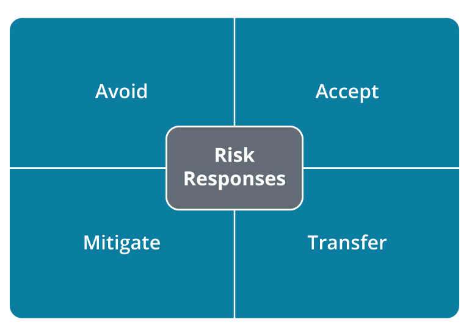

# 
 Risk Responses 

### * Avoid
<ins> Risk Avoidance:</ins> Often means that you stop doing an activity that is risk-bearing.

Example: Risk managers may discover that a software application has numerous hight-severity security vulnerabilities. After reporting this new finding and providing context to the risks, the governance team may decide that the cost of maintaining the application, or the probability of catastrophic failure due to the newly discovered vulnerabilityies, is not worth its benefit and so choose to have it decommissioned.

### * Accept
<ins>Risk Acceptance</ins>
means continuing to operate without change after evaluating an identified risk item. The risk item could be related to software, hardware, or existing processes. It is important to consider that there is risk in all we do; even simple tasks in day-to-day life involve risks. But despite this, we are still productive and largely safe so long as we are aware of risks and act within safe limits. Helping organizations operate in this way is precisely the goal of risk management—to help contain risks within carefully constructed and mutually agreed-upon boundaries because it is impossible to eliminate risk.

### * Mitigate
<ins> Risk Mitigation:</ins>
describes reducing exposure to risk items by implementing mitigating controls to ensure that technical business operations are safe. For example, there are many potential security issues associated with web applications. Since web applications are a critical component of many business processes, we must determine how to operate them safely while meeting the organization's needs. To do this, we use various means to improve the web application's safety and security through mitigating controls.

By implementing effective mitigating controls, we can reduce the overall risk. We implement mitigating controls until risk levels are reduced to a level deemed "acceptable" by risk managers and governance teams.

### * Transfer
<ins>Risk Transfer:</ins> means assigning risk to a third party, which is most typically accomplished through insurance policies. Insurance transfers financial risks to a third party. This is an important strategy as the cost of data breaches, and other cybersecurity events, can be extremely high and result in bankruptcy.

# Threat Modeling

### <ins> Threat Modeling </ins>

 is designed to identify the principal risks and tactics, techniques and procedures (TTPs) that a system may be subject to by evaluating the system both from an attacker's point of view and from the defender's point of view. For each scenario-based threat situation, the model asks whether defensive systems are sufficient to repel an attack perpetrated by an adversary with a given level of capability. Threat modeling can be used to assess risks against corporate networks and business systems, and it can also be performed against more specific targets, such as a website or software deployment. The outputs from threat modeling can be used to build use cases for security monitoring and detection systems. Threat modeling is typically a collaborative process, with inputs from a variety of stakeholders. In addition to cybersecurity experts with knowledge of the relevant threat intelligence and research, stakeholders can include nonexperts, such as users and customers, and persons with different priorities to the technical side, such as those who represent financial, marketing, and legal concerns.
