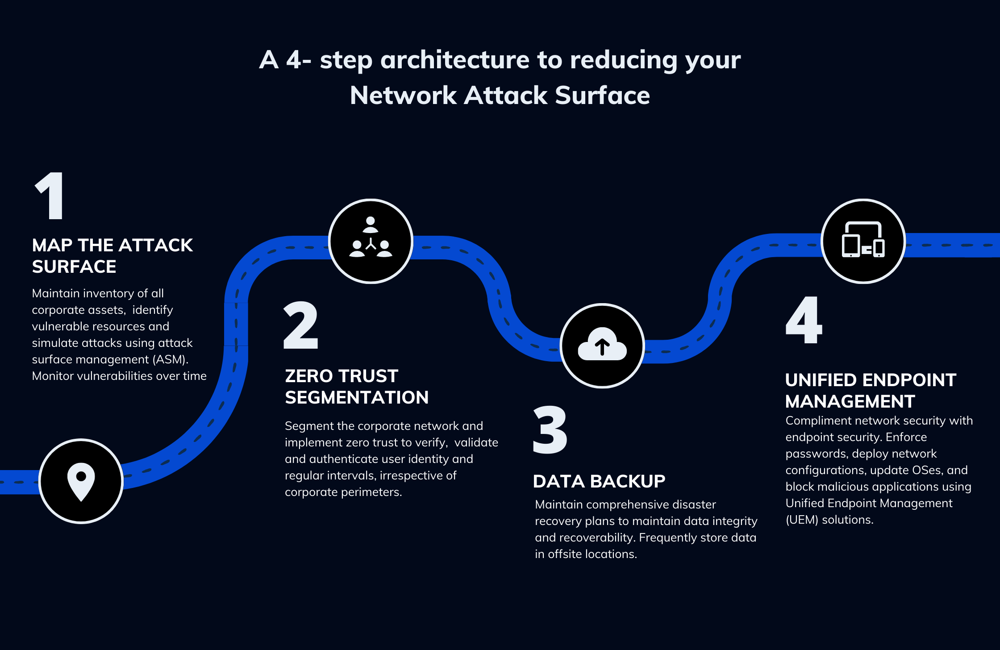

# Control Types and Methods

 ## Security Control Categories

 ### <ins>Technical:</ins> 
 The control is implemented as a system (hardware, software, or firmware). For example, firewalls, antivirus software, and OS access control models are technical controls. Technical controls may also be described as logical controls.

 ### <ins>Operational:</ins>
 The control is implemented primarily by people rather than systems. For example, security guards and training programs are operational controls rather than technical controls.

 ### <ins>Managerial:</ins>
 The control gives oversight of the information system. Examples could include risk identification or a tool allowing the evaluation and selection of other security controls.

 ## Security Control Functional Types

 ### <ins>Preventative:</ins>
 The control acts to eliminate or reduce the likelihood that an attack can succeed. A preventative control operates before an attack can take place. Access control lists (ACL) configured on firewalls and file system objects are preventative-type controls. Antimalware software also acts as a preventative control, by blocking processes identified as malicious from executing. Directives and standard operating procedures (SOPs) can be thought of as administrative versions of preventative controls.

 ### <ins>Detective:</ins>
 The control may not prevent or deter access, but it will identify and record any attempted or successful intrusion. A detective control operates during the progress of an attack. Logs provide one of the best examples of detective-type controls.

### <ins>Corrective:</ins>
The control acts to eliminate or reduce the impact of an intrusion event. A corrective control is used after an attack. A good example is a backup system that can restore data that was damaged during an intrusion. Another example is a patch management system that acts to eliminate the vulnerability exploited during the attack.

### <ins>Compensating:</ins>
The control serves as a substitute for a principal control, as recommended by a security standard, and affords the same (or better) level of protection but uses a different methodology or technology.

### <ins>Responsive:</ins>
These controls serve to direct corrective actions enacted after an incident has been confirmed. In a Security Operations Center (SOC), responsive controls might include several very well-defined actions to be taken by an analyst after identifying a specific issue. These actions are often documented in a playbook.

# Managing Attack Surface

As previously described, threat models are valuable tools that allow a system to be deconstructed into its functional parts to understand better how a threat actor might exploit it. Furthermore,threat models seek to identify which threat actors are likely to attempt to exploit the system

An <ins>attack surface</ins> describes all potential pathways a threat actor could use to gain unauthorized access or control. Each piece of software, service, and every enabled protocol on an endpoint offers a unique opportunity for attack. Removing or disabling as many of these as possible can significantly reduce the number of (potentially) exploitable pathways into a system. Additionally, default configurations typically favor functionality and compatibility over security, so it is essential to understand how to customize a system to allow for the most secure type of operation, not necessarily the most convenient. Several hardening guides are available that outline secure configurations in precise detail.

An organization's attack surface is broad, and every asset is interconnected. The overall attack surface is composed of every asset's attack surface. To keep this in perspective, every on-premises device, cloud resource, external service (i.e., software as a service (SaaS), online storage, or software repository), or external network configured to access the organization is part of the attack surface.

<ins>Attack Surface Management </ins>  describes the methods used to continuously monitor an environment to quickly identify changes to its attack surface. This type of monitoring seeks to continuously locate shadow-IT and other unknown devices, weak or default passwords, misconfigurations, missing patches, and many other items of concern.

## Managing the attack surface

<ins>footprint:</ins> An attack that aims to list resources on the network, host, or system as a whole to identify potential targets for further attack.

### <ins>Passive Discovery:</ins>
can be a practical approach to managing the attack surface. Passive discovery describes the methods used to identify systems, services, and protocols indirectly. Passive discovery, such as  network packet capture, can reveal information about network-connected hosts, communications channels, protocols in use, and activity patterns. Passive discovery is beneficial as it leverages careful observation to show characteristics of network-connected software and devices.

### <ins>Edge Discovery:</ins>

seeks to define the "edge" of the network fully. It is easy to assume that the edge is composed only of Internet-facing servers. The edge is instead composed of every device with Internet connectivity. Assuming that attacks will occur from the Internet, anything accessible to it must be considered as part of the edge. The US Cybersecurity & Infrastructure Security Agency (CISA) identified that 90% of successful cyberattacks start with a phishing email. This fact underscores that an organization's edge is much broader than is often assumed. 

### <ins>Reducing the Attack Surface:</ins>
- Asset inventory: 
Conducting an inventory of all hardware and software assets and user accounts in the environment. Once identified, the team must determine which assets are essential for business operations and which can be removed.

- Access control: 
Implementing strict access control measures, such as multifactor authentication, can reduce the attack surface significantly. Limiting access to sensitive data and systems reduces the risk of unauthorized access.

- Patching and updating: 
Regularly patching and updating software and firmware can prevent attackers from exploiting known vulnerabilities. Patching should be performed via automated patch management systems.

- Network segmentation: 
Segmenting a large network into smaller subnets can limit the damage an attacker can cause. By segmenting the network, the breaches and infections can be more effectively contained, thereby reducing the attack surface.

- Removing unnecessary components:  
Removing hardware or software components reduces the attack surface. By removing software, the organization eliminates a pathway that attackers can exploit.

- Employee training: 
Employee training can help reduce the attack surface by raising awareness of the potential risks and the importance of security measures. Regular training can help employees recognize and report potential security threats, reducing the likelihood of successful attacks.
